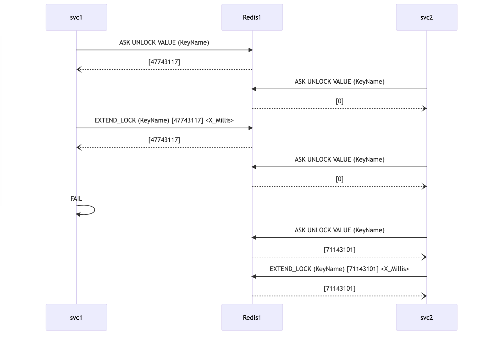

# scratch

Simple python code tests of various things I am learning/testing.

1. Create a virtual environment:

```
python3 -m venv venv 
```

2. Activate it:  [This step is repeated anytime you want this venv back]

```
source venv/bin/activate
```

On windows you would do:

```
venv\Scripts\activate
```

3. Python will utilize this requirements.txt in the project:

```
redis>=4.3.4
```

4. Run: [this step is repeated anytime you want this venv]

```
pip3 install -r requirements.txt
```

5. Execute the simplejsonsearch.py code (or another example) from the project directory:

```
python3 simplejsonsearch.py 
```

6. If you get errors it is most likely because you haven't configured the host and port and or username and password to your redis server (each example expects you to modify the code to provide these things)

7. when you are done exploring this set of examples you can deactivate the virtual environment:

```
deactivate
```

useful link to python docs for redis:
https://redis.readthedocs.io/en/stable/redismodules.html 

Sequence Diagram for lockoutServiceClient.py:


